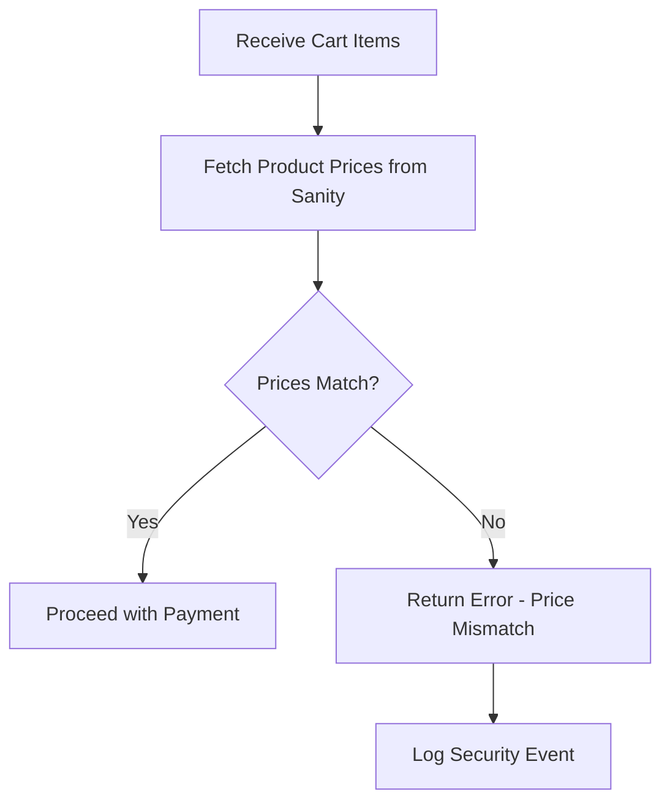
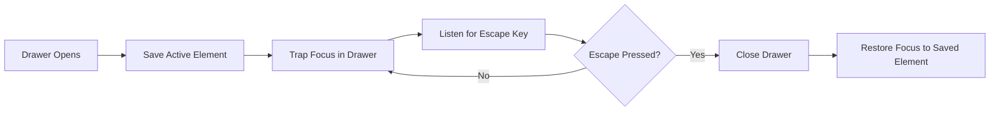
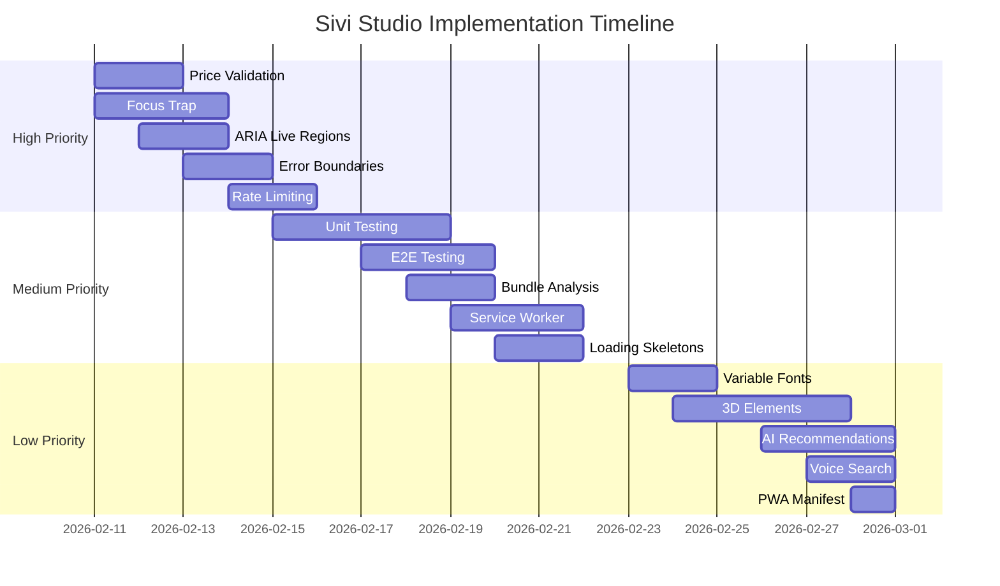

# Sivi Studio - Implementation Plan for Identified Gaps

> **Version 1.0** — Created February 10, 2026
> Comprehensive action plan to address code review findings

---

## 📋 Table of Contents

1. [Executive Summary](#executive-summary)
2. [High Priority Fixes](#high-priority-fixes)
3. [Medium Priority Enhancements](#medium-priority-enhancements)
4. [Low Priority Future Features](#low-priority-future-features)
5. [Implementation Timeline](#implementation-timeline)
6. [Technical Specifications](#technical-specifications)

---

## Executive Summary

This plan addresses **23 identified gaps** across security, accessibility, performance, and code quality. The implementation is organized into three priority tiers:

| Priority | Issues | Estimated Effort | Impact |
|----------|--------|------------------|--------|
| **High** | 5 | Critical | Security & Accessibility |
| **Medium** | 5 | Significant | Performance & Quality |
| **Low** | 5 | Nice-to-have | Future Features |

---

## High Priority Fixes

### 1. Server-Side Price Validation

**Issue**: Payment API skips price validation, allowing potential tampering.

**Location**: [`src/app/api/payment/create-order/route.ts`](src/app/api/payment/create-order/route.ts:8)

**Solution**:



**Implementation Steps**:

1. Create price validation utility:
   ```typescript
   // src/lib/payment/validate-prices.ts
   export async function validateCartPrices(
     cartItems: CartItem[]
   ): Promise<{ valid: boolean; errors: string[] }> {
     const productIds = cartItems.map(item => item.product._id);
     const products = await getProductsByIds(productIds);
     
     const errors: string[] = [];
     
     for (const cartItem of cartItems) {
       const dbProduct = products.find(p => p._id === cartItem.product._id);
       
       if (!dbProduct) {
         errors.push(`Product ${cartItem.product._id} not found`);
         continue;
       }
       
       if (dbProduct.price !== cartItem.product.price) {
         errors.push(`Price mismatch for ${dbProduct.title}`);
       }
     }
     
     return { valid: errors.length === 0, errors };
   }
   ```

2. Update payment API to use validation:
   ```typescript
   // src/app/api/payment/create-order/route.ts
   import { validateCartPrices } from '@/lib/payment/validate-prices';
   
   export const POST = withAuth(async (request: NextRequest, { user }) => {
     const { items, shipping_address_id } = await request.json();
     
     // Validate prices before proceeding
     const validation = await validateCartPrices(items);
     if (!validation.valid) {
       return NextResponse.json(
         { error: 'Price validation failed', details: validation.errors },
         { status: 400 }
       );
     }
     
     // Continue with payment flow...
   });
   ```

3. Add security logging:
   ```typescript
   // src/lib/security/logger.ts
   export async function logSecurityEvent(
     event: string,
     userId: string,
     details: any
   ) {
     await supabase.from('security_events').insert({
       event,
       user_id: userId,
       details,
       timestamp: new Date().toISOString(),
     });
   }
   ```

**Files to Create/Modify**:
- ✅ Create: `src/lib/payment/validate-prices.ts`
- ✅ Create: `src/lib/security/logger.ts`
- ✅ Modify: `src/app/api/payment/create-order/route.ts`
- ✅ Modify: `src/lib/sanity/client.ts` (add `getProductsByIds` if not present)

---

### 2. Focus Trap Implementation

**Issue**: Drawers and modals don't trap focus, breaking keyboard navigation.

**Affected Components**:
- [`CartDrawer`](src/components/cart/CartDrawer.tsx:1)
- `NavigationOverlay` (not reviewed)
- Any future modals

**Solution**:



**Implementation Steps**:

1. Create reusable focus trap hook:
   ```typescript
   // src/hooks/useFocusTrap.ts
   import { useEffect, useRef } from 'react';
   
   export function useFocusTrap(isActive: boolean) {
     const containerRef = useRef<HTMLElement>(null);
     const previousActiveElement = useRef<HTMLElement | null>(null);
   
     useEffect(() => {
       if (!isActive || !containerRef.current) return;
   
       // Save current focused element
       previousActiveElement.current = document.activeElement as HTMLElement;
   
       // Find all focusable elements
       const focusableElements = containerRef.current.querySelectorAll(
         'button, [href], input, select, textarea, [tabindex]:not([tabindex="-1"])'
       );
       const firstElement = focusableElements[0] as HTMLElement;
       const lastElement = focusableElements[focusableElements.length - 1] as HTMLElement;
   
       // Focus first element
       firstElement?.focus();
   
       // Handle tab key
       const handleTab = (e: KeyboardEvent) => {
         if (e.key !== 'Tab') return;
   
         if (e.shiftKey) {
           if (document.activeElement === firstElement) {
             e.preventDefault();
             lastElement?.focus();
           }
         } else {
           if (document.activeElement === lastElement) {
             e.preventDefault();
             firstElement?.focus();
           }
         }
       };
   
       containerRef.current.addEventListener('keydown', handleTab);
   
       return () => {
         containerRef.current?.removeEventListener('keydown', handleTab);
         // Restore focus
         previousActiveElement.current?.focus();
       };
     }, [isActive]);
   
     return containerRef;
   }
   ```

2. Update CartDrawer to use focus trap:
   ```typescript
   // src/components/cart/CartDrawer.tsx
   import { useFocusTrap } from '@/hooks/useFocusTrap';
   
   export default function CartDrawer() {
     const { isCartOpen, closeCart } = useCart();
     const drawerRef = useFocusTrap(isCartOpen);
   
     // Add Escape key handler
     useEffect(() => {
       const handleEscape = (e: KeyboardEvent) => {
         if (e.key === 'Escape' && isCartOpen) {
           closeCart();
         }
       };
       
       if (isCartOpen) {
         document.addEventListener('keydown', handleEscape);
       }
       
       return () => document.removeEventListener('keydown', handleEscape);
     }, [isCartOpen, closeCart]);
   
     return (
       <AnimatePresence>
         {isCartOpen && (
           <motion.div
             ref={drawerRef}
             role="dialog"
             aria-modal="true"
             aria-label="Shopping cart"
             // ... rest of drawer
           >
             {/* Drawer content */}
           </motion.div>
         )}
       </AnimatePresence>
     );
   }
   ```

**Files to Create/Modify**:
- ✅ Create: `src/hooks/useFocusTrap.ts`
- ✅ Modify: `src/components/cart/CartDrawer.tsx`
- ✅ Modify: `src/components/ui/NavigationOverlay.tsx`
- ✅ Create: Any future modal components

---

### 3. ARIA Live Regions for Cart Updates

**Issue**: Cart updates not announced to screen readers.

**Solution**:

1. Create screen reader announcer utility:
   ```typescript
   // src/lib/utils/accessibility.ts
   export function announceToScreenReader(
     message: string,
     politeness: 'polite' | 'assertive' = 'polite'
   ) {
     // Remove existing live region
     const existing = document.getElementById('sr-announcer');
     if (existing) existing.remove();
   
     // Create new live region
     const announcer = document.createElement('div');
     announcer.id = 'sr-announcer';
     announcer.setAttribute('aria-live', politeness);
     announcer.setAttribute('aria-atomic', 'true');
     announcer.className = 'sr-only';
     announcer.textContent = message;
   
     document.body.appendChild(announcer);
   
     // Remove after announcement
     setTimeout(() => announcer.remove(), 1000);
   }
   ```

2. Add CSS for screen reader only:
   ```css
   /* src/app/globals.css */
   .sr-only {
     position: absolute;
     width: 1px;
     height: 1px;
     padding: 0;
     margin: -1px;
     overflow: hidden;
     clip: rect(0, 0, 0, 0);
     white-space: nowrap;
     border-width: 0;
   }
   ```

3. Update CartContext to announce changes:
   ```typescript
   // src/context/CartContext.tsx
   import { announceToScreenReader } from '@/lib/utils/accessibility';
   
   const addToCart = (product: Product, quantity: number = 1, size?: string) => {
     // ... existing logic
     
     setItems((prevItems) => {
       const existingItem = prevItems.find((item) => item.variantId === variantId);
       
       if (existingItem) {
         const newQuantity = existingItem.quantity + quantity;
         announceToScreenReader(
           `${product.title} quantity updated to ${newQuantity}`
         );
         // ... update logic
       } else {
         announceToScreenReader(`${product.title} added to cart`);
         // ... add logic
       }
     });
   };
   
   const removeFromCart = (variantId: string) => {
     const item = items.find(i => i.variantId === variantId);
     setItems((prevItems) => prevItems.filter((item) => item.variantId !== variantId));
     if (item) {
       announceToScreenReader(`${item.product.title} removed from cart`, 'assertive');
     }
   };
   ```

**Files to Create/Modify**:
- ✅ Create: `src/lib/utils/accessibility.ts`
- ✅ Modify: `src/app/globals.css`
- ✅ Modify: `src/context/CartContext.tsx`
- ✅ Modify: `src/context/WishlistContext.tsx`

---

### 4. Error Boundaries for Route Segments

**Issue**: Only one ErrorBoundary component exists, not used extensively.

**Solution**:

1. Create enhanced ErrorBoundary component:
   ```typescript
   // src/components/ui/ErrorBoundary.tsx
   'use client';
   
   import { Component, ReactNode } from 'react';
   import { Button } from '@/components/ui/Button';
   
   interface Props {
     children: ReactNode;
     fallback?: ReactNode;
     onError?: (error: Error, errorInfo: any) => void;
   }
   
   interface State {
     hasError: boolean;
     error: Error | null;
   }
   
   export class ErrorBoundary extends Component<Props, State> {
     constructor(props: Props) {
       super(props);
       this.state = { hasError: false, error: null };
     }
   
     static getDerivedStateFromError(error: Error): State {
       return { hasError: true, error };
     }
   
     componentDidCatch(error: Error, errorInfo: any) {
       console.error('ErrorBoundary caught:', error, errorInfo);
       this.props.onError?.(error, errorInfo);
       
       // Log to error tracking service
       if (typeof window !== 'undefined') {
         // Send to error tracking (Sentry, LogRocket, etc.)
       }
     }
   
     render() {
       if (this.state.hasError) {
         if (this.props.fallback) {
           return this.props.fallback;
         }
   
         return (
           <div className="min-h-screen flex items-center justify-center bg-bone p-6">
             <div className="max-w-md text-center">
               <h1 className="font-serif text-4xl text-charcoal mb-4">
                 Something went wrong
               </h1>
               <p className="text-charcoal-400 mb-8">
                 We apologize for the inconvenience. Please try again.
               </p>
               <Button onClick={() => window.location.reload()}>
                 Refresh Page
               </Button>
             </div>
           </div>
         );
       }
   
       return this.props.children;
     }
   }
   ```

2. Create error layout for route segments:
   ```typescript
   // src/app/error.tsx
   'use client';
   
   import { useEffect } from 'react';
   import ErrorBoundary from '@/components/ui/ErrorBoundary';
   
   export default function Error({
     error,
     reset,
   }: {
     error: Error & { digest?: string };
     reset: () => void;
   }) {
     useEffect(() => {
       console.error('Application error:', error);
     }, [error]);
   
     return (
       <ErrorBoundary
         fallback={
           <div className="min-h-screen flex items-center justify-center bg-bone p-6">
             <div className="max-w-md text-center">
               <h1 className="font-serif text-4xl text-charcoal mb-4">
                 Application Error
               </h1>
               <p className="text-charcoal-400 mb-4">
                 {error.message || 'An unexpected error occurred'}
               </p>
               <button
                 onClick={reset}
                 className="px-6 py-3 bg-charcoal text-bone hover:bg-sage transition-colors"
               >
                 Try Again
               </button>
             </div>
           </div>
         }
       >
         {null}
       </ErrorBoundary>
     );
   }
   ```

3. Add error boundaries to key routes:
   ```typescript
   // src/app/shop/error.tsx
   // src/app/account/error.tsx
   // src/app/checkout/error.tsx
   ```

**Files to Create/Modify**:
- ✅ Modify: `src/components/ui/ErrorBoundary.tsx`
- ✅ Create: `src/app/error.tsx`
- ✅ Create: `src/app/shop/error.tsx`
- ✅ Create: `src/app/account/error.tsx`
- ✅ Create: `src/app/checkout/error.tsx`

---

### 5. API Rate Limiting

**Issue**: API routes lack rate limiting protection.

**Solution**:

1. Create rate limiting middleware:
   ```typescript
   // src/lib/middleware/rate-limit.ts
   import { NextRequest, NextResponse } from 'next/server';
   
   interface RateLimitStore {
     [key: string]: { count: number; resetTime: number };
   }
   
   // In production, use Redis or similar
   const rateLimitStore: RateLimitStore = {};
   
   export interface RateLimitConfig {
     windowMs: number;      // Time window in milliseconds
     maxRequests: number;   // Max requests per window
   }
   
   export function createRateLimiter(config: RateLimitConfig) {
     return async (request: NextRequest): Promise<{ success: boolean; remaining: number }> => {
       const identifier = request.ip || request.headers.get('x-forwarded-for') || 'unknown';
       const now = Date.now();
       
       // Clean up old entries
       Object.keys(rateLimitStore).forEach(key => {
         if (rateLimitStore[key].resetTime < now) {
           delete rateLimitStore[key];
         }
       });
       
       // Get or create entry
       const entry = rateLimitStore[identifier] || { count: 0, resetTime: now + config.windowMs };
       
       // Reset if window expired
       if (entry.resetTime < now) {
         entry.count = 0;
         entry.resetTime = now + config.windowMs;
       }
       
       // Check limit
       if (entry.count >= config.maxRequests) {
         return { success: false, remaining: 0 };
       }
       
       // Increment count
       entry.count++;
       rateLimitStore[identifier] = entry;
       
       return {
         success: true,
         remaining: config.maxRequests - entry.count,
       };
     };
   }
   
   // Pre-configured limiters
   export const strictLimiter = createRateLimiter({ windowMs: 60000, maxRequests: 10 });
   export const standardLimiter = createRateLimiter({ windowMs: 60000, maxRequests: 100 });
   export const looseLimiter = createRateLimiter({ windowMs: 60000, maxRequests: 1000 });
   ```

2. Create rate limit wrapper for API routes:
   ```typescript
   // src/lib/middleware/with-rate-limit.ts
   import { NextRequest, NextResponse } from 'next/server';
   import { createRateLimiter, RateLimitConfig } from './rate-limit';
   
   export function withRateLimit(
     handler: (request: NextRequest) => Promise<NextResponse>,
     config: RateLimitConfig
   ) {
     const limiter = createRateLimiter(config);
   
     return async (request: NextRequest) => {
       const { success, remaining } = await limiter(request);
   
       if (!success) {
         return NextResponse.json(
           { error: 'Too many requests. Please try again later.' },
           { 
             status: 429,
             headers: {
               'X-RateLimit-Limit': config.maxRequests.toString(),
               'X-RateLimit-Remaining': '0',
               'Retry-After': Math.ceil(config.windowMs / 1000).toString(),
             }
           }
         );
       }
   
       const response = await handler(request);
       
       // Add rate limit headers
       response.headers.set('X-RateLimit-Limit', config.maxRequests.toString());
       response.headers.set('X-RateLimit-Remaining', remaining.toString());
       
       return response;
     };
   }
   ```

3. Apply to API routes:
   ```typescript
   // src/app/api/payment/create-order/route.ts
   import { withRateLimit } from '@/lib/middleware/with-rate-limit';
   
   export const POST = withRateLimit(
     withAuth(async (request: NextRequest, { user }) => {
       // ... existing logic
     }),
     { windowMs: 60000, maxRequests: 5 } // Strict limit for payment
   );
   ```

**Files to Create/Modify**:
- ✅ Create: `src/lib/middleware/rate-limit.ts`
- ✅ Create: `src/lib/middleware/with-rate-limit.ts`
- ✅ Modify: All API routes in `src/app/api/`

---

## Medium Priority Enhancements

### 6. Unit Testing Setup

**Solution**:

1. Install testing dependencies:
   ```bash
   npm install --save-dev jest @testing-library/react @testing-library/jest-dom @testing-library/user-event jest-environment-jsdom
   ```

2. Create Jest configuration:
   ```javascript
   // jest.config.js
   const nextJest = require('next/jest');
   
   const createJestConfig = nextJest({
     dir: './',
   });
   
   const customJestConfig = {
     setupFilesAfterEnv: ['<rootDir>/jest.setup.js'],
     testEnvironment: 'jest-environment-jsdom',
     moduleNameMapper: {
       '^@/(.*)$': '<rootDir>/src/$1',
     },
     collectCoverageFrom: [
       'src/**/*.{js,jsx,ts,tsx}',
       '!src/**/*.d.ts',
       '!src/**/*.stories.{js,jsx,ts,tsx}',
     ],
   };
   
   module.exports = createJestConfig(customJestConfig);
   ```

3. Create setup file:
   ```javascript
   // jest.setup.js
   import '@testing-library/jest-dom';
   ```

4. Add test scripts to package.json:
   ```json
   {
     "scripts": {
       "test": "jest",
       "test:watch": "jest --watch",
       "test:coverage": "jest --coverage"
     }
   }
   ```

5. Create example tests:
   ```typescript
   // src/components/cart/__tests__/CartDrawer.test.tsx
   import { render, screen, fireEvent } from '@testing-library/react';
   import CartDrawer from '../CartDrawer';
   import { CartProvider } from '@/context/CartContext';
   
   describe('CartDrawer', () => {
     it('renders empty cart message', () => {
       render(
         <CartProvider>
           <CartDrawer />
         </CartProvider>
       );
       expect(screen.getByText('Your cart is empty')).toBeInTheDocument();
     });
   
     it('closes on escape key', () => {
       render(
         <CartProvider>
           <CartDrawer />
         </CartProvider>
       );
       fireEvent.keyDown(document, { key: 'Escape' });
       // Assert drawer closes
     });
   });
   ```

**Files to Create/Modify**:
- ✅ Create: `jest.config.js`
- ✅ Create: `jest.setup.js`
- ✅ Modify: `package.json`
- ✅ Create: `src/components/cart/__tests__/CartDrawer.test.tsx`
- ✅ Create: `src/components/shop/__tests__/ProductCard.test.tsx`
- ✅ Create: `src/context/__tests__/CartContext.test.tsx`

---

### 7. E2E Testing with Playwright

**Solution**:

1. Install Playwright:
   ```bash
   npm install --save-dev @playwright/test
   npx playwright install
   ```

2. Create Playwright configuration:
   ```typescript
   // playwright.config.ts
   import { defineConfig, devices } from '@playwright/test';
   
   export default defineConfig({
     testDir: './e2e',
     fullyParallel: true,
     forbidOnly: !!process.env.CI,
     retries: process.env.CI ? 2 : 0,
     workers: process.env.CI ? 1 : undefined,
     reporter: 'html',
     use: {
       baseURL: 'http://localhost:3000',
       trace: 'on-first-retry',
     },
     projects: [
       { name: 'chromium', use: { ...devices['Desktop Chrome'] } },
       { name: 'firefox', use: { ...devices['Desktop Firefox'] } },
       { name: 'webkit', use: { ...devices['Desktop Safari'] } },
     ],
     webServer: {
       command: 'npm run dev',
       url: 'http://localhost:3000',
       reuseExistingServer: !process.env.CI,
     },
   });
   ```

3. Create E2E tests:
   ```typescript
   // e2e/checkout.spec.ts
   import { test, expect } from '@playwright/test';
   
   test.describe('Checkout Flow', () => {
     test('complete purchase flow', async ({ page }) => {
       await page.goto('/');
       await page.click('text=Shop');
       await page.click('.product-card:first-child');
       await page.click('text=Add to Cart');
       await page.click('[aria-label="Open cart"]');
       await page.click('text=Proceed to Checkout');
       // Continue with checkout steps...
     });
   });
   ```

**Files to Create/Modify**:
- ✅ Create: `playwright.config.ts`
- ✅ Create: `e2e/checkout.spec.ts`
- ✅ Create: `e2e/auth.spec.ts`
- ✅ Create: `e2e/cart.spec.ts`

---

### 8. Bundle Analysis

**Solution**:

1. Install bundle analyzer:
   ```bash
   npm install --save-dev @next/bundle-analyzer
   ```

2. Update next.config.ts:
   ```typescript
   // next.config.ts
   import type { NextConfig } from 'next';
   import withBundleAnalyzer from '@next/bundle-analyzer';
   
   const nextConfig: NextConfig = {
     // ... existing config
   };
   
   export default withBundleAnalyzer(nextConfig, {
     enabled: process.env.ANALYZE === 'true',
   });
   ```

3. Add analyze script:
   ```json
   {
     "scripts": {
       "analyze": "ANALYZE=true next build"
     }
   }
   ```

4. Implement code splitting for heavy components:
   ```typescript
   // src/app/shop/page.tsx
   import dynamic from 'next/dynamic';
   
   const ProductCard = dynamic(() => import('@/components/shop/ProductCard'), {
     loading: () => <ProductCardSkeleton />,
   });
   ```

**Files to Create/Modify**:
- ✅ Modify: `next.config.ts`
- ✅ Modify: `package.json`
- ✅ Create: `src/components/shop/ProductCardSkeleton.tsx`

---

### 9. Service Worker for Offline Support

**Solution**:

1. Install next-pwa:
   ```bash
   npm install next-pwa
   ```

2. Update next.config.ts:
   ```typescript
   // next.config.ts
   import withPWA from 'next-pwa';
   
   const nextConfig: NextConfig = {
     // ... existing config
   };
   
   export default withPWA({
     dest: 'public',
     register: true,
     skipWaiting: true,
     disable: process.env.NODE_ENV === 'development',
   })(nextConfig);
   ```

3. Create offline fallback page:
   ```typescript
   // src/app/offline/page.tsx
   export default function Offline() {
     return (
       <div className="min-h-screen flex items-center justify-center bg-bone">
         <div className="text-center">
           <h1 className="font-serif text-4xl text-charcoal mb-4">
             You're Offline
           </h1>
           <p className="text-charcoal-400">
             Check your connection and try again.
           </p>
         </div>
       </div>
     );
   }
   ```

**Files to Create/Modify**:
- ✅ Modify: `next.config.ts`
- ✅ Create: `src/app/offline/page.tsx`

---

### 10. Loading Skeletons

**Solution**:

1. Create skeleton components:
   ```typescript
   // src/components/ui/Skeleton.tsx
   export function Skeleton({ className }: { className?: string }) {
     return (
       <div
         className={`animate-pulse bg-ivory-200 rounded ${className}`}
       />
     );
   }
   
   // src/components/shop/ProductCardSkeleton.tsx
   export function ProductCardSkeleton() {
     return (
       <div className="space-y-4">
         <Skeleton className="aspect-[3/4] w-full" />
         <Skeleton className="h-6 w-3/4" />
         <Skeleton className="h-4 w-1/2" />
       </div>
     );
   }
   ```

2. Use in product listing:
   ```typescript
   // src/app/shop/page.tsx
   import { ProductCardSkeleton } from '@/components/shop/ProductCardSkeleton';
   
   export default async function ShopPage() {
     const products = await getProducts();
     
     return (
       <div className="grid grid-cols-1 md:grid-cols-3 gap-8">
         {products.map(product => (
           <ProductCard key={product._id} product={product} />
         ))}
       </div>
     );
   }
   
   // For client-side loading
   export default function ShopPage() {
     const { products, isLoading } = useProducts();
     
     return (
       <div className="grid grid-cols-1 md:grid-cols-3 gap-8">
         {isLoading
           ? Array.from({ length: 6 }).map((_, i) => (
               <ProductCardSkeleton key={i} />
             ))
           : products.map(product => (
               <ProductCard key={product._id} product={product} />
             ))
         }
       </div>
     );
   }
   ```

**Files to Create/Modify**:
- ✅ Create: `src/components/ui/Skeleton.tsx`
- ✅ Create: `src/components/shop/ProductCardSkeleton.tsx`
- ✅ Modify: Product listing pages

---

## Low Priority Future Features

### 11. Variable Fonts Implementation

**Solution**:

1. Add variable font to layout:
   ```typescript
   // src/app/layout.tsx
   import { Inter } from 'next/font/google';
   
   const inter = Inter({
     subsets: ['latin'],
     variable: '--font-inter',
     display: 'swap',
     axes: ['opsz', 'wght'], // Variable axes
   });
   ```

2. Update CSS for variable font usage:
   ```css
   /* src/app/globals.css */
   .text-variable {
     font-variation-settings: 'wght' var(--font-weight, 400), 'opsz' var(--font-size, 16);
   }
   ```

---

### 12. 3D Elements with Three.js

**Solution**:

1. Install Three.js:
   ```bash
   npm install three @react-three/fiber @react-three/drei
   ```

2. Create 3D fabric viewer:
   ```typescript
   // src/components/3d/FabricViewer.tsx
   'use client';
   
   import { Canvas } from '@react-three/fiber';
   import { OrbitControls, useTexture } from '@react-three/drei';
   
   function FabricMesh({ textureUrl }: { textureUrl: string }) {
     const texture = useTexture(textureUrl);
     
     return (
       <mesh>
         <planeGeometry args={[2, 3]} />
         <meshStandardMaterial map={texture} />
       </mesh>
     );
   }
   
   export function FabricViewer({ textureUrl }: { textureUrl: string }) {
     return (
       <div className="w-full h-96">
         <Canvas camera={{ position: [0, 0, 3] }}>
           <ambientLight intensity={0.5} />
           <directionalLight position={[10, 10, 5]} />
           <FabricMesh textureUrl={textureUrl} />
           <OrbitControls enableZoom={false} />
         </Canvas>
       </div>
     );
   }
   ```

---

### 13. AI Product Recommendations

**Solution**:

1. Create recommendation API:
   ```typescript
   // src/app/api/recommendations/route.ts
   import { withAuth } from '@/lib/auth/jwt';
   
   export const GET = withAuth(async (request: NextRequest, { user }) => {
     const { searchParams } = new URL(request.url);
     const productId = searchParams.get('productId');
     
     // Get user's browsing history
     const history = await getUserBrowsingHistory(user.id);
     
     // Simple collaborative filtering
     const recommendations = await getRecommendations(productId, history);
     
     return NextResponse.json({ recommendations });
   });
   ```

---

### 14. Voice Search

**Solution**:

1. Create voice search hook:
   ```typescript
   // src/hooks/useVoiceSearch.ts
   import { useState, useEffect } from 'react';
   
   export function useVoiceSearch() {
     const [isListening, setIsListening] = useState(false);
     const [transcript, setTranscript] = useState('');
     
     useEffect(() => {
       if (!('webkitSpeechRecognition' in window)) return;
       
       const recognition = new (window as any).webkitSpeechRecognition();
       recognition.continuous = false;
       recognition.interimResults = false;
       
       recognition.onresult = (event: any) => {
         setTranscript(event.results[0][0].transcript);
         setIsListening(false);
       };
       
       recognition.onerror = () => setIsListening(false);
       
       if (isListening) {
         recognition.start();
       }
       
       return () => recognition.stop();
     }, [isListening]);
     
     return { isListening, transcript, start: () => setIsListening(true) };
   }
   ```

---

### 15. PWA Manifest

**Solution**:

1. Create manifest:
   ```json
   // public/manifest.json
   {
     "name": "Sivi the Couturier",
     "short_name": "Sivi",
     "description": "Indian Handloom Heritage & Custom Tailoring",
     "start_url": "/",
     "display": "standalone",
     "background_color": "#FDFCFB",
     "theme_color": "#9CA770",
     "icons": [
       {
         "src": "/icon-192.png",
         "sizes": "192x192",
         "type": "image/png"
       },
       {
         "src": "/icon-512.png",
         "sizes": "512x512",
         "type": "image/png"
       }
     ]
   }
   ```

2. Add to layout:
   ```typescript
   // src/app/layout.tsx
   export const metadata: Metadata = {
     manifest: '/manifest.json',
     // ... other metadata
   };
   ```

---

## Implementation Timeline



---

## Technical Specifications

### File Structure After Implementation

```
src/
├── components/
│   ├── ui/
│   │   ├── ErrorBoundary.tsx (enhanced)
│   │   └── Skeleton.tsx (new)
│   ├── cart/
│   │   └── CartDrawer.tsx (with focus trap)
│   └── shop/
│       ├── ProductCard.tsx
│       └── ProductCardSkeleton.tsx (new)
├── context/
│   ├── CartContext.tsx (with ARIA announcements)
│   └── WishlistContext.tsx (with ARIA announcements)
├── hooks/
│   ├── useFocusTrap.ts (new)
│   ├── useSafeMotion.ts
│   └── useVoiceSearch.ts (new)
├── lib/
│   ├── middleware/
│   │   ├── rate-limit.ts (new)
│   │   └── with-rate-limit.ts (new)
│   ├── payment/
│   │   └── validate-prices.ts (new)
│   ├── security/
│   │   └── logger.ts (new)
│   └── utils/
│       └── accessibility.ts (new)
└── app/
    ├── error.tsx (new)
    ├── shop/
    │   └── error.tsx (new)
    ├── account/
    │   └── error.tsx (new)
    ├── checkout/
    │   └── error.tsx (new)
    └── offline/
        └── page.tsx (new)

e2e/ (new)
├── checkout.spec.ts
├── auth.spec.ts
└── cart.spec.ts

jest.config.js (new)
jest.setup.js (new)
playwright.config.ts (new)
```

---

## Success Criteria

Each implementation should meet these criteria:

| Feature | Success Criteria |
|---------|------------------|
| Price Validation | All cart prices verified against database before payment |
| Focus Trap | Keyboard users can navigate drawers without escaping |
| ARIA Live | Screen readers announce all cart changes |
| Error Boundaries | No unhandled errors crash the application |
| Rate Limiting | API endpoints protected from abuse |
| Unit Tests | 70%+ code coverage for critical components |
| E2E Tests | All user flows tested and passing |
| Bundle Size | Initial JS bundle under 200KB |
| Offline Support | App works offline with cached content |
| Loading States | All async operations show loading indicators |

---

## Next Steps

1. **Review and approve** this implementation plan
2. **Prioritize** features based on business needs
3. **Set up** development environment for testing
4. **Begin implementation** starting with High Priority items
5. **Monitor** progress and adjust timeline as needed

---

**Document Status**: Ready for Review
**Last Updated**: February 10, 2026
**Next Review**: After High Priority completion
